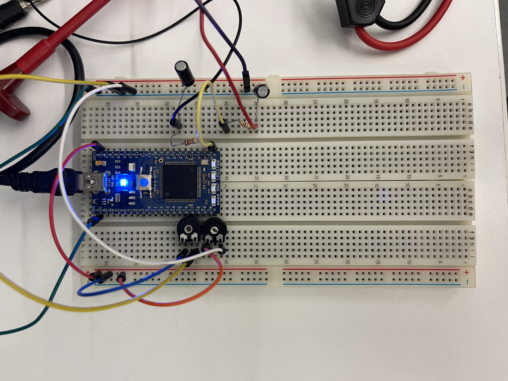
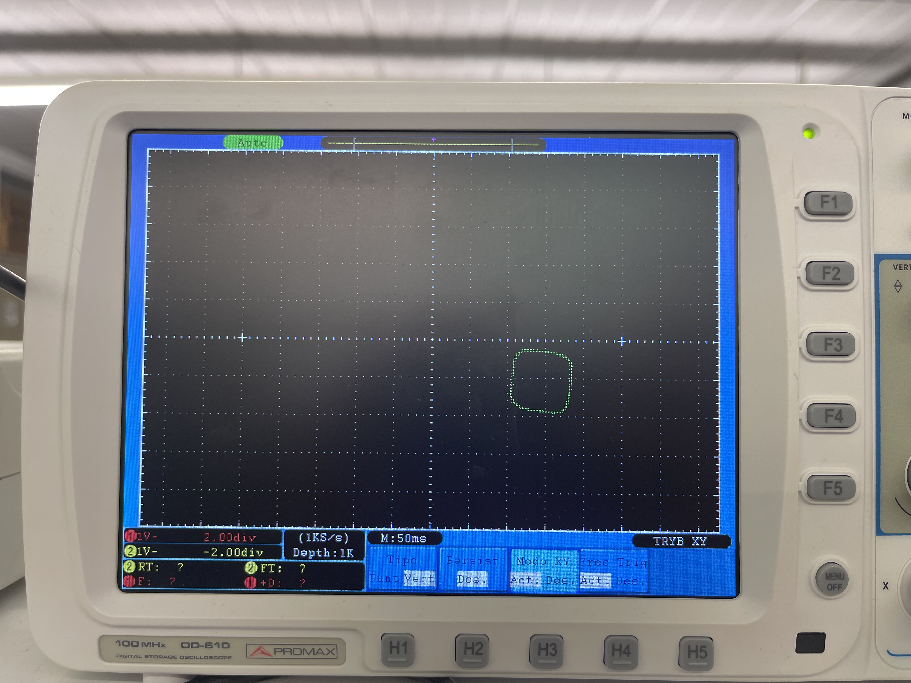
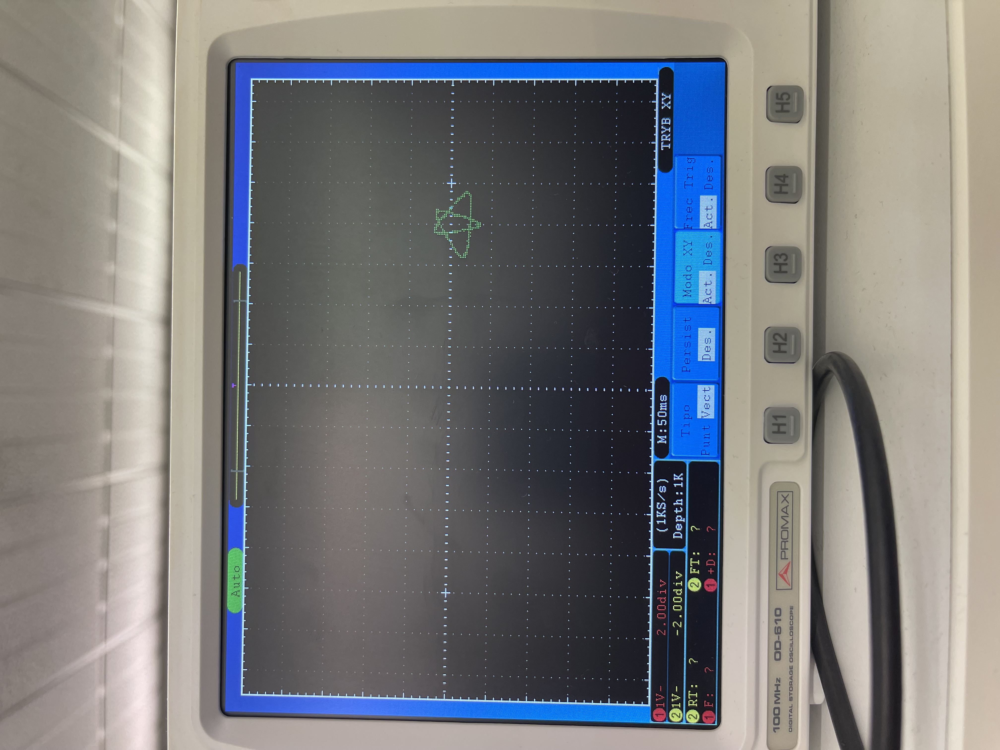

# P3: PWM
### Jesus Antoñanzas, Nico Ares | SEU, 2023


**0.1: muntatge del circuit**

Montem el circuit d'acord a l'esquema proporcionat a la pràctica:



**0.2: determinant el període de les entrades**

Per determinar el període de les senyals PWM, considerem les característiques dels condensadors i les resistències utilitzades al circuit. En el nostre cas, els condensadors són de $4.7 \mu F = 4.7 \times 10^{-6}F$, i les resistències són de $10$ kOhm. Doncs,  $\tau = 4.7 \times 10^{-6} \times 10000 = 0.047 s$. Definim el període dels outputs com $\tau / 100 = 0.00047s$. Notem com a característica del nostre microcontrolador que el rellotge que goberna la funció `wait_ms` fa que `wait_ms(10)` esperi en realitat 100 ms (*10). Això ja passava a l'anterior pràctica.


**Programa 1.1: dibuixant un quadrat a l'oscil·loscopi**

El primer programa dibuixa un quadrat en un oscil·loscopi. Utilitza dues sortides PWM, out1 i out2, per generar els senyals necessaris. La funció `drawLine`

```c++
void drawLine(float startX, float endX, float startY, float endY, int duration) {
    float xStep = (endX - startX) / duration;
    float yStep = (endY - startY) / duration;

    for (int i = 0; i < duration; i++) {
        out1.write(startX + i * xStep);
        out2.write(startY + i * yStep);
        wait_ms(1);
    }
}
```

crea punts en una línia, permetent dibuixar els costats del quadrat. Definint les cantonades del quadrat i cridant repetidament a `drawLine``, el programa fa que un quadrat aparegui a la pantalla de l'oscil·loscopi.



**Programa 1.2: dibuixant una estrella a l'oscil·loscopi**

El segon programa és una mica més complicat, ja que dibuixa una estrella. Segueix la mateixa estructura del primer, però afegeix un array 2D amb les coordenades dels vèrtexs de l'estrella. El programa dibuixa línies entre aquests punts, i així es forma una estrella a l'oscil·loscopi.



**Programa 2: creació d'un cursor a l'oscil·loscopi**

El tercer programa, en lloc de dibuixar figures, es concentra en mostrar un cursor a l'oscil·loscopi. Aquest cursor es pot moure a partir de la variació de la corrent d'entrada mitjançant dos potenciòmetres (un per l'eix x i l'altre per l'eix y). Aquestes dades es passen a les sortides PWM, mostrant els senyals analògics a l'oscil·loscopi.
